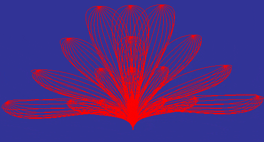
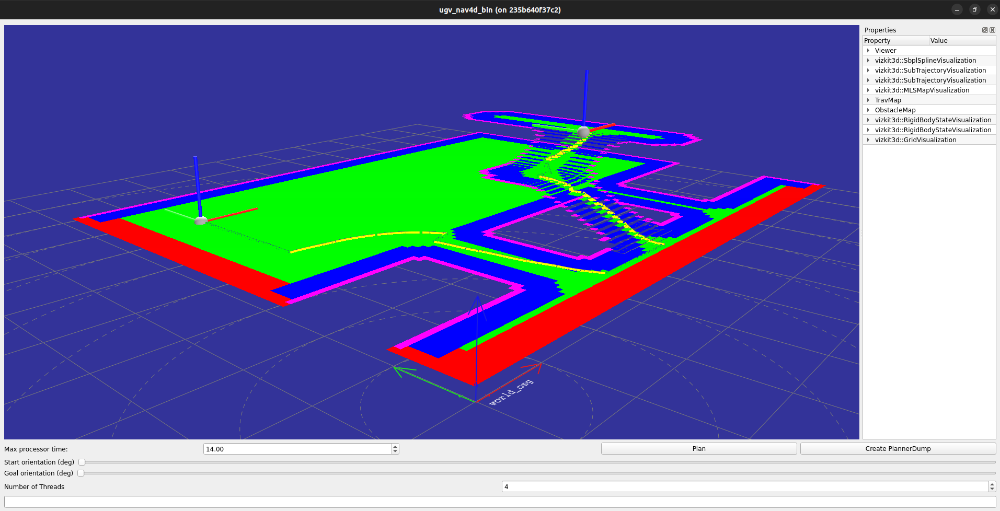

# Summary

The ugv_nav4d is a global path planner designed for terrestrial robots to navigate complex indoor and outdoor environments. To achieve this, ugv_nav4d uses a traversability map (TraversabilityMap3d) based on a multi-layered surface map (MLSMap) [@mlsmaps], [@slammaps], enabling planning in multi-surface environments. The path is built by selecting motion primitives tailored to the robot's mechanical features, ensuring compatibility with its motion capabilities.

{width="300pt"}

# Statement of need
Accurate ground surface representation is crucial for ground-based robots in complex terrains. The ROS Navigation Stack (nav2) [@ros2], which uses voxel maps for 3D navigation, often loses detail and accuracy, especially in multi-storey environments, due to its discrete voxelization and separate costmaps for each floor.

We propose ugv_nav4d, a path planner that enhances environmental representation with Multi-Layered Surface Maps (MLS) [@mlsmaps] and a 3D Traversability Map [@slammaps]. Ugv_nav4d avoids the "stepping" effect of voxel maps by using a continuous grid and detailed vertical information, providing smoother and more accurate terrain modeling.

Unlike nav2, ugv_nav4d simplifies planning with a single TraversabilityMap3D, which contains detailed ground surface data, offering a superior alternative to nav2’s 3D costmaps. For users, MLS maps provide a smoother, more realistic view of terrain compared to the blocky voxel maps, enhancing navigation and decision-making in complex environments.
 
# Software Components 
The core software components of the planner are 

- EnvironmentXYZTheta
- PathPlanner
- PreComputedMotions

### EnvironmentXYZTheta 
The core of ugv_nav4d is based on SBPL (Search-Based Planning Library) [@sbpl]. The EnvironmentXYZTheta implements all interfaces needed by SBPL to enable ARA* based planning. The environment in SBPL is a state space which connects states with associated transition costs. A state is defined by the position (x,y,z) and orientation (yaw) of the robot. The EnvironmentXYZTheta uses a TraversabilityGenerator3d [@travgen3d] to generate a TraversabilityMap3d from a MLSMap, which classifies the MLSMap patches into traversable, non-traversable, and unknown terrain and stores meta data of the ground surface (e.g., slope of the patch, supporting plane, etc.). 

![The Moon Crater and its TraversabilityMap3d in the Space Hall at the RIC, DFKI [@roboticsElab]\label{fig:crater}.](figures/trav_map_and_space_hall.png){width="300pt"}

### PathPlanner
The search for the shortest path in ugv_nav4d is based on the SBPL-provided ARA* planner. It builds a state space of future robot states and uses a time heuristic to compute the shortest path on the TraversabilityMap3D. Robot and terrain-specific information, including robot dimensions and orientations, collision checks with obstacles, terrain steepness, and motion primitives are incorporated as additional costs in the search for the successive states. The planner generates a complete trajectory for the planned path, which can then be executed by a trajectory follower [@trajectoryfollower].

 in the final demostration of the project [KIMMI-SF](https://robotik.dfki-bremen.de/de/forschung/projekte/kimmi-sf).](figures/motion_planning_hunter.png){width="200pt" height="300pt"}

### PreComputedMotions  
Motion primitives are pre-defined movements stored as spline trajectories, representing feasible robot motions from a given pose (x, y, z, yaw). The planner uses these primitives to find successor states, ensuring paths are traversable and collision-free. Each motion has a base cost for flat surfaces, with additional penalties for factors like steepness. Primitives fall into four categories: Forward, Backward, Lateral, and Point-Turn. These primitives can be tailored for different robot types: Ackermann drive robots use forward and backward primitives, differential drive robots can use point-turn primitives, and omni-directional robots utilize all four types. Point-turn primitives are unique as they don't use splines, unlike the others generated by the SbplSplineMotionPrimitives library [@sbplsplineprimitives].

{width="200pt" height="300pt"}

# Debugging

### PlannerGui
A GUI for ugv_nav4d allows debugging and testing by experimenting with planner parameters on a static map. The PlannerGui can load point clouds from ply or serialized MLS maps, using left and right clicks to set start and end locations. Errors can be logged to a file and ugv_nav4d_replay can be used to analyze the state and execute planning in a controlled environment.

{width="200pt" height="300pt"}

# Field Tests
ugv_nav4d has been used extensively in research projects for almost a decade. It has been utilized for autonomous navigation in several projects, including [Entern](https://robotik.dfki-bremen.de/de/forschung/projekte/entern), [ANT](https://robotik.dfki-bremen.de/de/forschung/projekte/ant), [VIPE](https://robotik.dfki-bremen.de/de/forschung/projekte/vipe), [KIMMI-SF](https://robotik.dfki-bremen.de/de/forschung/projekte/kimmi-sf), [HiSE](https://robotik.dfki-bremen.de/de/forschung/projekte/hise), [PerSim](https://robotik.dfki-bremen.de/de/forschung/projekte/persim), and [CoRobX](https://robotik.dfki-bremen.de/de/forschung/projekte/corob-x). As a versatile planner, it has also been used for various terrestrial robots, such as [Artemis](https://robotik.dfki-bremen.de/de/forschung/robotersysteme/artemis), [Coyote-III](https://robotik.dfki-bremen.de/de/forschung/robotersysteme/coyote-iii), [Crex](https://robotik.dfki-bremen.de/de/forschung/robotersysteme/crex), [Charlie](https://robotik.dfki-bremen.de/de/forschung/robotersysteme/charlie), [Hunter-SE](https://robotik.dfki-bremen.de/de/forschung/robotersysteme/hunterse), [SherpaTT](https://robotik.dfki-bremen.de/de/forschung/robotersysteme/sherpatt), and [Asguard-IV](https://robotik.dfki-bremen.de/de/forschung/robotersysteme/asguard-iv).

# Acknowledgements 
The ugv_nav4d library was initiated and is currently developed at the Robotics Innovation Center of the German Research Center for Artificial Intelligence (DFKI) in Bremen, together with the Robotics Group of the University of Bremen. The development was started in the scope of the Entern project (50RA1406), which has been funded by the German Aerospace Center (DLR) with funds from the German Federal Ministry for Economic Affairs and Climate Action (BMWK). 

We would also like to acknowledge the contributors of the ugv_nav4d repository, including the developers visible on the project's GitHub contributors page, for their valuable efforts and dedication. 

# References